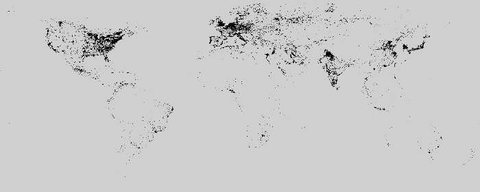

# Monthly global VIIRS mosaic masked with DMSP/OLS 

> **Project name**: "Estimating Seasonal Population via Night-Time Satellite Images" (SEPT). 

> A project funded by [Greek General secretariat and Technology & Hellenic Foundation For Research and Innovation](http://www.gsrt.gr/).

> [Spatial Analysis, GIS and Thematic Mapping Laboratory
Department of Planning and Regional Development
University of Thessaly, School of Engineering](http://www.gislab.gr/)

The scripts included in the current repository create global mosaic for [*suomi npp VIIRS* ("vcmsl" version, stray-light corrected data) monthly geotiffs](https://ngdc.noaa.gov/eog/viirs/download_dnb_composites.html) [1] which
are masked with values *​​(DN>=6)* of 2013 *DMSP/OLS* data. The goal of the mask application is to exclude ephemeral lights and noise.

The final files are produced in geotiff format, compressed with *LZW* compression algorithm and saved as *unsigned 16-bit integer (UInt16)* data type.
The mothly mosaics were created for the years 2014, 2015, 2016.

## Intercalibrated DMSP/OLS data
The intercalibrated version of DMSP/OLS data [2],[3] were used for the masking of VIIRS tiles. 
These data are available in the `ols_tiles` folder. They have been reprojected in WGS84, have been fragmented into tiles corresponding to those of VIIRS and have been converted into binary formats so as DN>=6 => 1 and DN<6 => Null.

## Prerequisites

For the successful execution of the process via *bash scripts*, the following software/libraries must be preinstalled:

* [wget](https://www.gnu.org/software/wget/), necessary to download the data from the relevant site.
* [tar](https://www.gnu.org/software/tar/), [pv](http://man7.org/linux/man-pages/man1/pv.1.html), to decompress and monitor the progress of decompression of the *.tgz files.
* [gdalbuildvrt](https://www.gdal.org/gdalbuildvrt.html), [gdal_translate](https://www.gdal.org/gdal_translate.html), to convert the data type of geotiff files and create the global mosaic.
* [gdal_calc](https://www.gdal.org/gdal_calc.html), to apply the "mask" to the data.

## Usage 

To complete the process of creating the global mosaic, the following sscripts were executed successively:

* *[downloadData.sh](downloadData.sh)*: downloads the necessary tiles stored in tgz compressed format from the [NGDC Earth Observation Group (EOG)](https://ngdc.noaa.gov/eog/index.html). Files for download are provided through a file with a list of the URLs of `* .tgz` files.

* *[extractData.sh](extractData.sh)*: decompresses the files `.avg_rade9h.tif` from the compressed `*.tgz` files.

* *[float2int.sh](float2int.sh)*: convert geotiffs to UInt16 data type.

* *[maskData.sh](maskData.sh)*: masks the VIIRS data based on 2013 DMSP/OLS data.
Excludes the pixels that they have *DN<6* in 2013 DMSP/OLS data.

* *[mosaic.sh](mosaic.sh)*: creates a global mosaic of the VIIRS individual tiles.

* *[compressData.sh](compressData.sh)*: Compress global VIIRS geotiffs to `*tar.gz` files .

### Example
Monthly VIIRS tiles are available for download in the files [2014.txt](2014/2014.txt), [2015/2015.txt](2015.txt), [2016/2016.txt](2015.txt).
An example is given for 2014. To generate the mosaic for 2014 the following commands are required:

* `downloadData.sh ./2014/2014.txt ./2014`
* `extractData.sh ./2014`
* `float2int.sh ./2014`
* `maskData.sh ./2014 ./ols_tiles`
* `mosaic.sh ./2014`
* `compressData.sh ./2014`

## Result
The output for 2014, 2015, 2016 is available in [osf.io repository](https://osf.io/f43br/?view_only=393bbd74f86845af8438cd084c0a962d).

## References
1. NOAA-National Geophysical Data Center, Version 1 VIIRS Day/Night Band Nighttime Lights, Earth Observation Group, NOAA/NCEI. URL https://ngdc.noaa.gov/eog/dmsp/downloadV4composites.html (accessed 05.05.2019).

2. Stathakis, D., 2016. Intercalibration of DMSP/OLS by Parallel Regressions. IEEE Geosci. Remote Sens. Lett. 13, 1420–1424. https://doi.org/10.1109/LGRS.2016.2582784

3. NOAA-National Geophysical Data Center, Defense Meteorological Satellite Program (DMSP), Global DMSP-OLS Nighttime Lights Time Series 1992 - 2013 (Version 4). Earth Observation Group - Defense Meteorological Satellite Progam, Boulder | ngdc.noaa.gov. URL https://ngdc.noaa.gov/eog/dmsp/downloadV4composites.html.

## License

This project is licensed under the MIT License - see the [LICENSE](LICENSE) file for details

